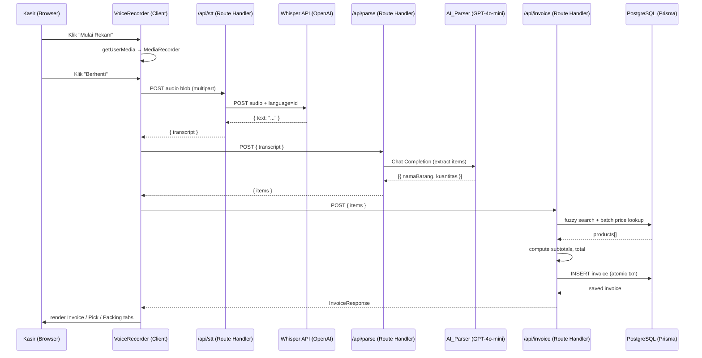
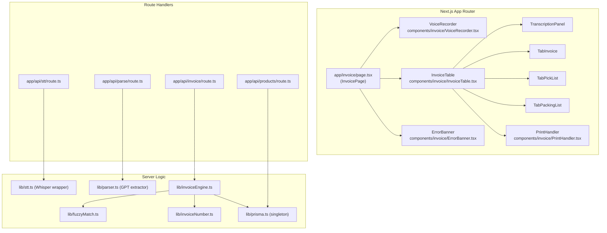

# Design Document: Voice-to-Invoice

## Overview

Voice-to-Invoice is an AI-powered cashier feature for the Tokomu app. A cashier speaks a list of items
and quantities; the system transcribes the audio, extracts structured item data, looks up prices in the
product catalog, computes totals, and presents a print-ready invoice alongside a Pick List and Packing
List — all without manual keyboard entry.

The feature is implemented entirely within the existing Next.js 15 App Router project. No separate
backend service is introduced; all server-side logic lives in Next.js Route Handlers and Prisma 7.

### Speech-to-Text SDK Recommendation

**Recommended: OpenAI Whisper API (`openai` npm package)**

Rationale:
- Whisper `whisper-1` supports Indonesian (`id`) out of the box with high accuracy.
- Accepts WAV and WebM directly, matching the formats the `Voice_Recorder` captures.
- Simple multipart upload API — one POST call, no streaming setup needed for ≤120 s clips.
- Latency for a 60-second clip is typically 2–4 s, well within the 5 s SLA.
- No self-hosting required; fits a Next.js serverless deployment.

Alternative: **Web Speech API** (browser-native, no cost) — excluded as primary because Indonesian
language support varies by browser, it has no offline fallback, and it cannot accept pre-recorded blobs
for retry scenarios. It may be used as a client-side fallback for Chrome.

---

## Architecture

### High-Level Data Flow



### Component Architecture



---

## Components and Interfaces

### Frontend Components

#### `VoiceRecorder`

Manages the full record → transcribe → parse → invoice submission lifecycle.

```typescript
interface VoiceRecorderProps {
  onInvoiceReady: (invoice: InvoiceResponse) => void;
  onError: (error: AppError) => void;
}

type RecorderState =
  | "idle"
  | "requesting_permission"
  | "recording"
  | "uploading"
  | "processing"
  | "done"
  | "error";
```

State machine transitions:
- `idle` → `requesting_permission` (click start)
- `requesting_permission` → `recording` (permission granted) | `error` (denied)
- `recording` → `uploading` (click stop or 120 s timer)
- `uploading` → `processing` (STT done) | `error` (STT fail, audio retained)
- `processing` → `done` (invoice ready) | `error`
- `error` → `idle` (click retry)

#### `InvoiceTable`

Pure display component. Receives an `InvoiceResponse` and renders three tabs.

```typescript
interface InvoiceTableProps {
  invoice: InvoiceResponse;
  transcript: string;
  onEditLine: (index: number, updated: Partial<ItemLine>) => void;
  onDeleteLine: (index: number) => void;
}
```

#### `PrintHandler`

Renders print-mode layouts and triggers `window.print()`.

```typescript
interface PrintHandlerProps {
  invoice: InvoiceResponse;
  storeName: string;
}
```

### API Route Interfaces

#### `POST /api/stt`

Request: `multipart/form-data` with field `audio` (Blob, WAV or WebM) and optional `sessionId`.

```typescript
// Response
interface SttResponse {
  transcript: string;
  sessionId: string;
}
// Error
interface SttError {
  code: "STT_SERVICE_UNAVAILABLE" | "STT_LOW_QUALITY" | "STT_AUDIO_TOO_LONG" | "STT_NO_SPEECH_DETECTED";
  message: string;
}
```

#### `POST /api/parse`

```typescript
interface ParseRequest {
  transcript: string;
  sessionId: string;
}
interface ParsedItem {
  namaBarang: string;
  kuantitas: number; // integer >= 1
}
interface ParseResponse {
  items: ParsedItem[];
  status: "OK" | "PARSER_NO_ITEMS_DETECTED";
}
```

#### `POST /api/invoice`

```typescript
interface InvoiceRequest {
  items: ParsedItem[];
  sessionId: string;
}
interface ItemLine {
  namaBarang: string;
  kuantitas: number;
  hargaSatuan: number; // integer, in Rupiah
  subtotal: number;    // integer
  status: "OK" | "NOT_FOUND" | "AMBIGUOUS";
  candidates?: ProductCandidate[]; // max 5, when AMBIGUOUS
}
interface ProductCandidate {
  id: string;
  nama: string;
  harga: number;
  score: number;
}
interface InvoiceResponse {
  nomorInvoice: string;
  tanggalWaktu: string; // ISO 8601
  transcript: string;
  itemLines: ItemLine[];
  totalKeseluruhan: number;
  pickList: PickListItem[];
  packingList: PackingListItem[];
}
interface PickListItem {
  namaBarang: string;
  kuantitas: number;
}
interface PackingListItem {
  namaBarang: string;
  kuantitas: number;
  packed: boolean; // always false on creation
}
```

#### `GET /api/products?q=<term>`

Returns up to 10 product search results for manual disambiguation UI.

### Shared Error Type

```typescript
interface AppError {
  code: string;
  message: string;
  stage: "stt" | "parse" | "invoice" | "db" | "network";
  sessionId?: string;
  timestamp: string; // ISO 8601
}
```

---

## Data Models

### Prisma Schema Additions

Add the following models to `prisma/schema.prisma`:

```prisma
model Product {
  id          String        @id @default(cuid())
  nama        String
  namaNormal  String        // lowercase, stripped for fuzzy index
  harga       Int           // in Rupiah, integer
  stok        Int           @default(0)
  createdAt   DateTime      @default(now())
  updatedAt   DateTime      @updatedAt
  invoiceItems InvoiceItem[]

  @@index([namaNormal])
}

model Invoice {
  id              String        @id @default(cuid())
  nomorInvoice    String        @unique
  tanggalWaktu    DateTime
  transcript      String
  totalKeseluruhan Int
  sessionId       String
  createdAt       DateTime      @default(now())
  items           InvoiceItem[]

  @@index([tanggalWaktu])
  @@index([nomorInvoice])
}

model InvoiceItem {
  id           String   @id @default(cuid())
  invoice      Invoice  @relation(fields: [invoiceId], references: [id])
  invoiceId    String
  product      Product? @relation(fields: [productId], references: [id])
  productId    String?
  namaBarang   String   // stored even if product not found
  kuantitas    Int
  hargaSatuan  Int      // 0 if NOT_FOUND
  subtotal     Int      // 0 if NOT_FOUND
  status       ItemStatus

  @@index([invoiceId])
}

enum ItemStatus {
  OK
  NOT_FOUND
  AMBIGUOUS
}
```

**Note on integer arithmetic:** `harga`, `hargaSatuan`, and `subtotal` are stored as `Int` (Rupiah, no
decimals) to guarantee exact arithmetic. All multiplication happens server-side in TypeScript with
integer operands before being stored.

### Daily Invoice Number Counter

A lightweight counter table avoids race conditions:

```prisma
model InvoiceCounter {
  date    String @id    // "YYYYMMDD" WIB
  counter Int    @default(0)
}
```

The `invoiceNumber.ts` module increments this atomically inside the same Prisma transaction as the
invoice insert.

---

## AI / STT Integration

### STT Layer (`lib/stt.ts`)

```typescript
import OpenAI from "openai";
import { toFile } from "openai/uploads";

const openai = new OpenAI(); // reads OPENAI_API_KEY from env

export async function transcribeAudio(
  audioBuffer: Buffer,
  mimeType: "audio/wav" | "audio/webm"
): Promise<string> {
  const ext = mimeType === "audio/wav" ? "wav" : "webm";
  const file = await toFile(audioBuffer, `recording.${ext}`, { type: mimeType });
  const response = await openai.audio.transcriptions.create({
    model: "whisper-1",
    file,
    language: "id",
    response_format: "text",
  });
  return response as unknown as string;
}
```

Error mapping from Whisper API HTTP codes to internal `SttError` codes is handled in the route handler.

### AI Parser Layer (`lib/parser.ts`)

GPT-4o-mini is used as the AI_Parser. A strict JSON-mode system prompt extracts item/quantity pairs:

```typescript
const SYSTEM_PROMPT = `
Kamu adalah parser kasir. Dari teks transkripsi bahasa Indonesia berikut,
ekstrak semua pasangan nama barang dan kuantitas.
Kembalikan HANYA JSON array dengan format:
[{"namaBarang": "...", "kuantitas": <integer>=1}, ...]
Aturan:
- Jika kuantitas tidak disebutkan, gunakan 1
- "selusin" atau "lusin" = 12
- Kenali angka digit maupun kata bilangan (satu=1, dua=2, ..., sepuluh=10, dll)
- Maks 50 item unik
- Jika tidak ada item terdeteksi, kembalikan []
`.trim();
```

The route handler validates the JSON output with Zod before returning it.

---

## Fuzzy Product Matching Strategy

### Algorithm: Trigram + Levenshtein hybrid (`lib/fuzzyMatch.ts`)

The search strategy is a two-step funnel:

**Step 1 — PostgreSQL trigram pre-filter (pg_trgm extension):**

```sql
-- Enable once per DB:
CREATE EXTENSION IF NOT EXISTS pg_trgm;
CREATE INDEX idx_product_trgm ON "Product" USING gin("namaNormal" gin_trgm_ops);

-- Query (parameterized):
SELECT id, nama, harga,
       similarity("namaNormal", $1) AS score
FROM "Product"
WHERE "namaNormal" % $1        -- similarity > pg_trgm.similarity_threshold (default 0.3)
ORDER BY score DESC
LIMIT 10;
```

**Step 2 — TypeScript Levenshtein re-rank:**

The up-to-10 candidates from Step 1 are re-scored using Levenshtein distance on the normalized name.
Items with distance > 2 from the query string are dropped. Remaining candidates are sorted by distance
(ascending), then by trigram similarity (descending) as a tiebreaker.

**Decision logic:**
- 0 candidates after re-rank → `NOT_FOUND`
- 1 candidate → `OK`, use that product
- 2–5 candidates → `AMBIGUOUS`, return all to frontend for manual selection
- >5 candidates → return top 5 only

`namaNormal` is computed on product insert/update:

```typescript
function normalize(s: string): string {
  return s.toLowerCase().trim().replace(/\s+/g, " ");
}
```

The query string from the transcription is passed through the same `normalize()` before querying.

---

## Print / PDF Strategy

### CSS `@media print` approach (no external library for standard invoices)

```css
/* globals.css additions */
@media print {
  .no-print { display: none !important; }
  .print-only { display: block !important; }
  body { font-size: 12pt; }
}

/* Struk layout: 80mm width */
.struk-layout {
  width: 80mm;
  font-family: monospace;
  font-size: 10pt;
}
```

The `PrintHandler` component renders two hidden `<div>` elements (one for Struk, one for Invoice Lengkap)
that are normally hidden (`hidden print:block`) and become visible only during `@media print`. Clicking
either print button sets a `data-print-mode` attribute on `<body>`, and CSS rules target the correct
layout.

```typescript
function printStruk() {
  document.body.dataset.printMode = "struk";
  window.print();
  delete document.body.dataset.printMode;
}
function printFull() {
  document.body.dataset.printMode = "full";
  window.print();
  delete document.body.dataset.printMode;
}
```

### PDF Export

`window.print()` → "Save as PDF" covers the majority of cases. For a programmatic download button, the
`jspdf` + `html2canvas` combination can be introduced as an optional enhancement in a later sprint, since
it adds ~250 kB to the client bundle. The initial implementation uses `window.print()` only.

---

## Error Handling Architecture

### Error Code Taxonomy

| Code | Stage | Meaning |
|------|-------|---------|
| `MIC_PERMISSION_DENIED` | stt | Microphone access refused |
| `RECORDING_TOO_SHORT` | stt | Audio < 1 second |
| `STT_SERVICE_UNAVAILABLE` | stt | Whisper API unreachable / 5xx |
| `STT_LOW_QUALITY` | stt | SNR < 10 dB (Whisper returns no text) |
| `STT_AUDIO_TOO_LONG` | stt | Audio > 120 s |
| `STT_NO_SPEECH_DETECTED` | stt | Valid audio, empty transcript |
| `PARSER_NO_ITEMS_DETECTED` | parse | Transcript has no items |
| `DB_CONNECTION_ERROR` | db | Prisma cannot reach PostgreSQL |
| `INVOICE_SAVE_FAILED` | db | Atomic insert failed |

### Server-Side Logging

Every Route Handler wraps its logic in a try/catch that calls `logError()`:

```typescript
function logError(err: AppError) {
  console.error(JSON.stringify({
    timestamp: err.timestamp,
    code: err.code,
    stage: err.stage,
    sessionId: err.sessionId,
    message: err.message,
  }));
}
```

Structured JSON logging allows log aggregation tools to parse fields without regex.

### Frontend Error Recovery

The `InvoiceSession` state (transcript, parsedItems, sessionId) lives in React state on `InvoicePage`.
It is **never cleared** when an error occurs — only when the user explicitly starts a new session. This
ensures that a `STT_SERVICE_UNAVAILABLE` error shows a "Coba Rekam Lagi" button while preserving any
partial state from earlier steps.

### Inline Item Editing

`InvoiceTable` receives `onEditLine` / `onDeleteLine` callbacks. Edits are applied to a local copy of the
`InvoiceResponse` held in `InvoicePage` state. After any edit:

```typescript
function recalculate(invoice: InvoiceResponse): InvoiceResponse {
  const items = invoice.itemLines.map(line => ({
    ...line,
    subtotal: line.status === "OK" ? line.hargaSatuan * line.kuantitas : 0,
  }));
  const total = items
    .filter(l => l.status !== "NOT_FOUND")
    .reduce((sum, l) => sum + l.subtotal, 0);
  return { ...invoice, itemLines: items, totalKeseluruhan: total };
}
```

Recalculation is a pure function applied synchronously — no network call needed.

---

## Correctness Properties

*A property is a characteristic or behavior that should hold true across all valid executions of a
system — essentially, a formal statement about what the system should do. Properties serve as the bridge
between human-readable specifications and machine-verifiable correctness guarantees.*

### Property 1: Subtotal Arithmetic Correctness

*For any* integer `hargaSatuan` ≥ 0 and integer `kuantitas` ≥ 1, the computed `subtotal` for an
`ItemLine` with status `OK` SHALL equal `hargaSatuan × kuantitas` exactly.

**Validates: Requirements 5.1**

---

### Property 2: Total Equals Sum of Non-NOT_FOUND Subtotals

*For any* list of `ItemLine` objects with arbitrary statuses and values, `totalKeseluruhan` SHALL equal
the exact sum of `subtotal` for all lines where `status !== "NOT_FOUND"`.

**Validates: Requirements 5.2**

---

### Property 3: NOT_FOUND Items Do Not Block Invoice Generation

*For any* list of parsed items where some or all items have `NOT_FOUND` status, the Invoice Engine SHALL
still produce a complete `InvoiceResponse` object. Lines with `NOT_FOUND` SHALL have `subtotal = 0`; all
other required fields SHALL be present and well-typed.

**Validates: Requirements 4.4, 5.5**

---

### Property 4: Invoice Number Format and Daily Uniqueness

*For any* `nomorInvoice` generated by the system, it SHALL match the pattern
`/^INV-\d{8}-\d{4}$/`. For any two invoices created on the same calendar day (WIB), their
four-digit sequence suffixes SHALL be distinct.

**Validates: Requirements 5.6**

---

### Property 5: Currency Formatter Round-Trip

*For any* non-negative integer price value `n`, `formatCurrency(n)` SHALL produce a string that:
1. Starts with `"Rp "`.
2. Contains no decimal point.
3. Uses `.` as a thousands separator.
4. Parses back to `n` when the prefix and separators are stripped.

**Validates: Requirements 6.6**

---

### Property 6: Fuzzy Match Candidate Count Bound

*For any* query string submitted to the fuzzy product matcher against any product catalog, the returned
candidate list SHALL have length between 0 and 5 (inclusive).

**Validates: Requirements 4.3**

---

### Property 7: Fuzzy Match Correctness for Near-Typos

*For any* product whose `namaNormal` exists in the catalog, and *for any* query string that differs from
that `namaNormal` by a Levenshtein distance ≤ 2, the fuzzy matcher SHALL include that product in the
candidate list with status `OK` or `AMBIGUOUS` (i.e., it SHALL NOT return `NOT_FOUND`).

**Validates: Requirements 4.2**

---

### Property 8: Parser Output Schema Invariant

*For any* non-empty transcription string processed by `AI_Parser`, every element in the returned array
SHALL have a non-empty string `namaBarang` and an integer `kuantitas` ≥ 1.

**Validates: Requirements 3.4**

---

### Property 9: Default Quantity for Items Without Explicit Count

*For any* item name mentioned in a transcription without an accompanying quantity expression, the parsed
`kuantitas` SHALL be 1.

**Validates: Requirements 3.3**

---

### Property 10: Pick List Contains Only Found Items

*For any* `InvoiceResponse`, the `pickList` SHALL contain exactly the items from `itemLines` where
`status !== "NOT_FOUND"`, with no additional or missing entries.

**Validates: Requirements 7.1**

---

### Property 11: Pick List Is Alphabetically Sorted

*For any* `InvoiceResponse` with two or more pick list entries, the `namaBarang` values SHALL appear in
non-descending alphabetical order (locale `id-ID`).

**Validates: Requirements 7.2**

---

### Property 12: Packing List Mirrors Pick List Content With Unchecked State

*For any* `InvoiceResponse`, the `packingList` SHALL contain the same set of `(namaBarang, kuantitas)`
pairs as the `pickList`, and every `packed` field SHALL be `false`.

**Validates: Requirements 8.1**

---

### Property 13: Inline Edit Recalculation Correctness

*For any* `InvoiceResponse` and any edit to an `ItemLine` (changing `kuantitas` or `hargaSatuan`), after
`recalculate()` is applied: the edited line's `subtotal` SHALL equal `hargaSatuan × kuantitas`, and
`totalKeseluruhan` SHALL equal the sum of all non-`NOT_FOUND` subtotals.

**Validates: Requirements 10.5**

---

## Testing Strategy

### Property-Based Testing

Use **fast-check** (TypeScript-native PBT library) for all property tests.

```
npm install --save-dev fast-check
```

Minimum 100 iterations per property test (fast-check default is 100 — keep it at ≥100).

Tag format in test files:
```typescript
// Feature: voice-to-invoice, Property 1: subtotal arithmetic correctness
```

**Properties to implement as PBT:**
- Properties 1, 2, 3, 4, 5, 6, 7, 8, 9, 10, 11, 12, 13 (all 13 above)

Pure functions to test (`lib/invoiceEngine.ts`, `lib/fuzzyMatch.ts`, `lib/parser.ts`,
`lib/formatCurrency.ts`, `lib/invoiceNumber.ts`) are straightforward to test with fast-check arbitraries:
- `fc.integer({ min: 0 })` for prices
- `fc.integer({ min: 1, max: 999 })` for quantities
- `fc.string()` for transcription text
- `fc.array(fc.record(...))` for item line lists

### Unit Tests

Use **Vitest** (already compatible with Vite/Turbopack toolchain).

Focus on:
- STT route handler: mock OpenAI client, verify error code mapping for each failure mode.
- Parser route handler: mock OpenAI chat completions, verify Zod validation rejects malformed JSON.
- Invoice route handler: mock Prisma, verify atomic transaction is used.
- `VoiceRecorder`: mock `navigator.mediaDevices.getUserMedia`, test permission denied / recording too short / auto-stop at 120 s.
- `InvoiceTable`: snapshot tests for NOT_FOUND row styling, currency formatting, tab switching.

Avoid duplicating what property tests already cover (arithmetic, sorting, candidate bounds).

### Integration Tests

Run against a test PostgreSQL database (Docker Compose) for:
- Full invoice creation flow end-to-end.
- `pg_trgm` fuzzy search with real product catalog data.
- Atomic invoice save: verify DB state after success and after simulated mid-transaction failure.
- Daily invoice counter reset at midnight.

### Test File Structure

```
src/
  __tests__/
    lib/
      invoiceEngine.test.ts    ← unit + property (Properties 1-3, 10-13)
      fuzzyMatch.test.ts       ← unit + property (Properties 6-7)
      formatCurrency.test.ts   ← property (Property 5)
      invoiceNumber.test.ts    ← property (Property 4)
      parser.test.ts           ← property (Properties 8-9)
    api/
      stt.test.ts
      parse.test.ts
      invoice.test.ts
    components/
      VoiceRecorder.test.tsx
      InvoiceTable.test.tsx
    integration/
      invoice.integration.test.ts
```
